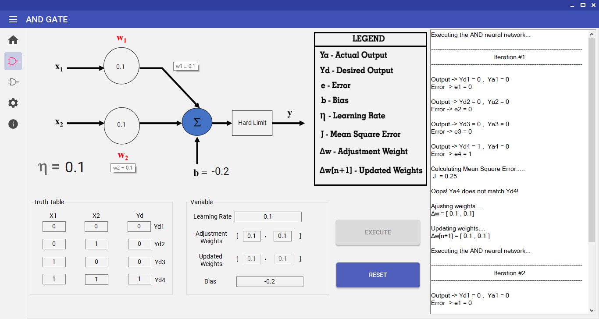

# ECLT:ERROR CORRECTION LEARNING TECHNIQUE

ERROR CORRECTION LEARNING TECHNIQUE

ECLT is an exclusive C# code written to visualize the Error Correction Learning Technique that is amongst the basic node of the Neural Network learning process. It's a tool that help students & teachers to easily understand the flow by looking at it. Rather than making hand written calculations, lengthy operations can be iterated within seconds of time. 

## SCREENSHOT
### HOME

### ANDGATE

### ORGATE

### SETTINGS

### ABOUT

## UI FEATURES

### Material Designing 

### Color Change 

### Theme Change 

## HOW IT WORKS?

### ANDGATE EXECUTION  

### ORGATE EXECUTION  
